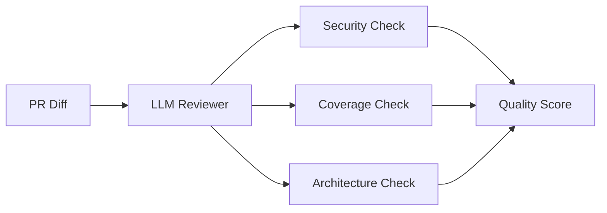

# agent-pr-quality-reviewer

[](https://github.com/Jai-Gogineni/agent-pr-quality-reviewer/actions)
[](LICENSE)
[](https://www.typescriptlang.org/)

Pull request quality review agent that analyzes code diffs for test coverage gaps, security vulnerabilities, and architecture anti-patterns. Provides actionable feedback with severity scores.

## How It Works



## Quick Start

```bash
git clone https://github.com/Jai-Gogineni/agent-pr-quality-reviewer.git
cd agent-pr-quality-reviewer
npm install
cp .env.example .env  # Add your API keys
npm run build
```

## Configuration

| Variable | Required | Description |
|----------|----------|-------------|
| `ANTHROPIC_API_KEY` | Yes | For code analysis |
| `GITHUB_TOKEN` | No | For PR comment posting |

## Example Usage

```typescript
import { PRQualityReviewerAgent } from "./src/agent";

const reviewer = new PRQualityReviewerAgent(process.env.ANTHROPIC_API_KEY!);
const review = await reviewer.reviewDiff(gitDiff);
console.log(`Quality Score: ${review.score}/10`);
console.log(`Issues: ${review.issues.join(", ")}`);
console.log(`Suggestions: ${review.suggestions.join(", ")}`);
```

## Architecture

Built with TypeScript for type safety, uses the Anthropic SDK for LLM capabilities, and follows a single-responsibility pattern where each agent has one clear job. Designed to be composable — agents can be chained together for complex workflows.

## Contributing

See [CONTRIBUTING.md](CONTRIBUTING.md) for guidelines.

## Author

**Jai Gogineni** — [jaigogineni.com](https://jaigogineni.com) · [LinkedIn](https://uk.linkedin.com/in/jai-gogineni-9a396654)
