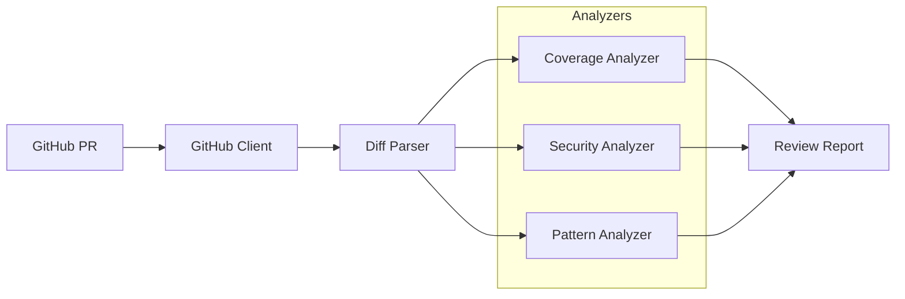

# agent-pr-quality-reviewer

[](https://github.com/Jai-Gogineni/agent-pr-quality-reviewer/actions/workflows/ci.yml)
[](https://opensource.org/licenses/MIT)
[](https://www.typescriptlang.org/)
[](https://modelcontextprotocol.io)

> PR quality reviewer — AI-powered code review for test coverage and security

## Architecture



## Quick Start

```bash
# Clone the repository
git clone https://github.com/Jai-Gogineni/agent-pr-quality-reviewer.git
cd agent-pr-quality-reviewer

# Install dependencies
npm install

# Build
npm run build
```

## Configuration

| Variable | Description |
|----------|-------------|
| `GITHUB_TOKEN` | GitHub personal access token with repo scope |

## Project Structure

```
src/
├── agent.ts                      # MCP server entry point
├── github-client.ts              # GitHub PR API wrapper
└── analyzers/
    ├── coverage-analyzer.ts      # Test coverage gap detection
    ├── security-analyzer.ts      # Secrets, SQL injection, eval detection
    └── pattern-analyzer.ts       # Architecture pattern violations
```

## Security Checks

| Rule | Severity | Description |
|------|----------|-------------|
| Hardcoded secrets | Critical | API keys, passwords, tokens in source |
| SQL injection | Critical | String concatenation in queries |
| eval() usage | Critical | Dynamic code execution |
| TLS disabled | Critical | Certificate verification bypassed |
| CORS wildcard | Warning | Unrestricted cross-origin access |
| Insecure random | Warning | Math.random() for security operations |

## MCP Tools

| Tool | Description |
|------|-------------|
| `review_pr` | Full PR review with coverage, security, and pattern checks |
| `analyze_diff` | Analyze a raw diff string for quality issues |

## License

MIT © 2024 Jai Gogineni
